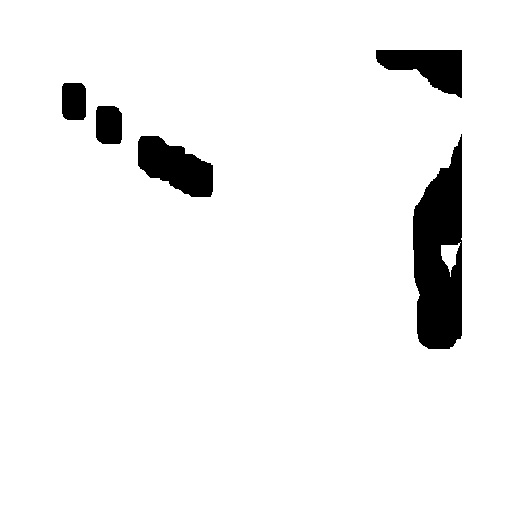
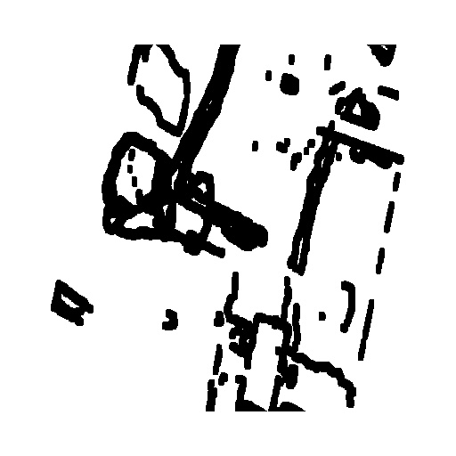
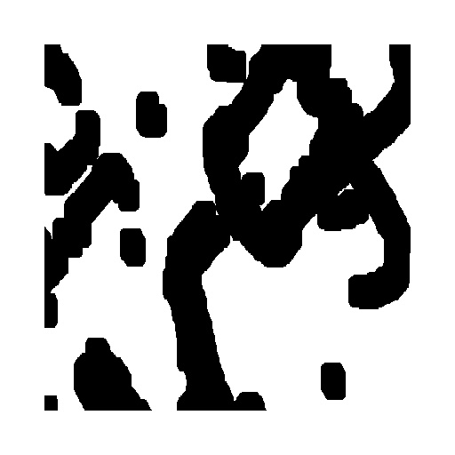
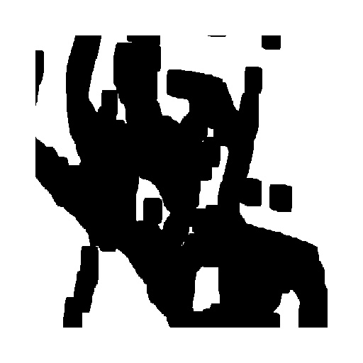
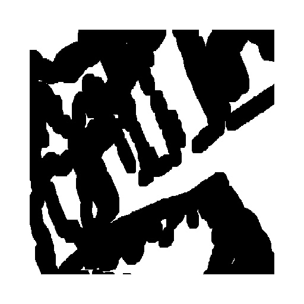
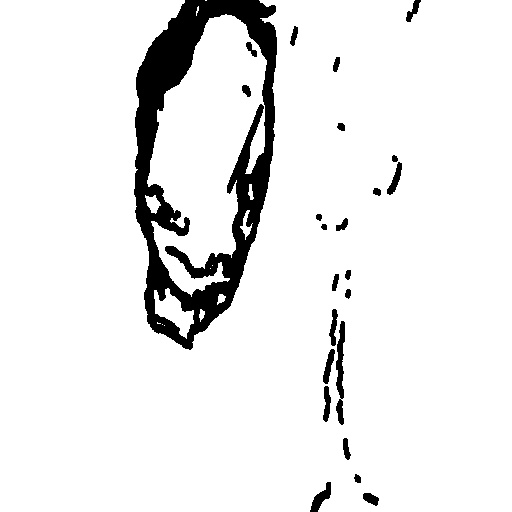
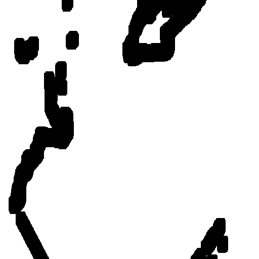
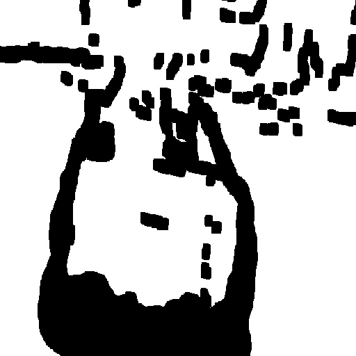
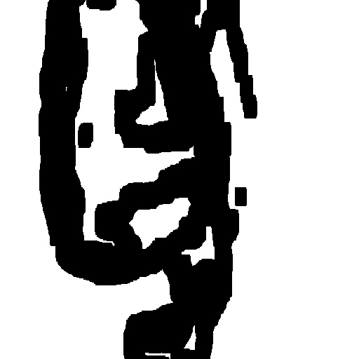
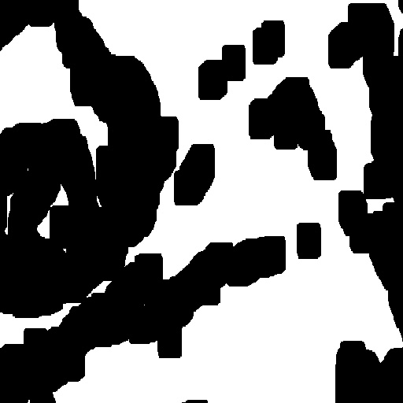

# NVIDIA-Inverted-Mask-Dataset

This is the inverted mask dataset of the testing set of NVIDIA Irregular Mask Dataset.

- 12,000 images: 12 categories of 1,000 images each.
- Image size: 512 x 512 (RGB)
- File format: JPG

The images are grouped in 12 categories with 6 hole-to-image area ratios (HTIAR), with and without border.

|       File name       | HTIAR - Original mask | HTIAR - Inverted mask |     Note    |
|:---------------------:|:---------------------:|:---------------------:|:-----------:|
| 00000.jpg - 00999.jpg | 0% - 10%              | 90% - 100%            | with border |
| 01000.jpg - 01999.jpg | 0% - 10%              | 90% - 100%            | no border   |
| 02000.jpg - 02999.jpg | 10% - 20%             | 80% - 90%%            | with border |
| 03000.jpg - 03999.jpg | 10% - 20%             | 80% - 90%%            | no border   |
| 04000.jpg - 04999.jpg | 20% - 30%             | 70% - 80%             | with border |
| 05000.jpg - 05999.jpg | 20% - 30%             | 70% - 80%             | no border   |
| 06000.jpg - 06999.jpg | 30% - 40%             | 60% - 70%             | with border |
| 07000.jpg - 07999.jpg | 30% - 40%             | 60% - 70%             | no border   |
| 08000.jpg - 08999.jpg | 40% - 50%             | 50% - 60%             | with border |
| 09000.jpg - 09999.jpg | 40% - 50%             | 50% - 60%             | no border   |
| 10000.jpg - 10999.jpg | 50% - 60%             | 40% - 50%             | with border |
| 11000.jpg - 11999.jpg | 50% - 60%             | 40% - 50%             | no border   |

## Sample images
With border  

Without border  

## Download
Zip file in [Google Drive](https://drive.google.com/drive/folders/19Qik5BVPhDNKfn1gJlzFNYvQ5gAjMSTc?usp=sharing).

## Agreement
"This dataset is for research purposed only."

## Reference

NVIDIA Irregular Mask Dataset: https://nv-adlr.github.io/publication/partialconv-inpainting
